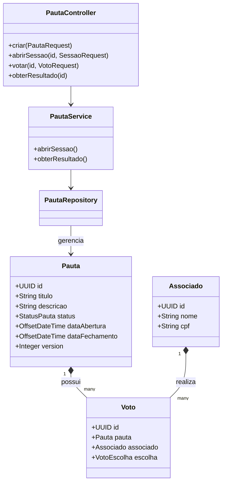

# 🗳️ Desafio Votação - Sistema de Gerenciamento

Sistema para gerenciamento de pautas e sessões de votação, permitindo a criação de associados, abertura de sessões e contabilização de votos.

## 🚀 Tecnologias e Requisitos

- **Java 25** (Spring Boot 4.0.5)
- **Maven** para gerenciamento de dependências.
- **PostgreSQL 16** (Banco de Dados).
- **Docker & Docker Compose** (Para subir o ambiente rapidamente).
- **Flyway** (Para migrações de banco de dados).

---

## 🛠️ Como Subir a Aplicação

### 1. Preparação do Ambiente
Renomeie o arquivo `.env.example` para `.env.dev` ou `.env.prod`:
```bash
# O arquivo .env deve conter:
POSTGRES_DB=votacao
POSTGRES_USER=postgres
POSTGRES_PASSWORD=postgres
DB_URL=jdbc:postgresql://db:5432/votacao
```

### 2. Execução via Docker (Recomendado)
Para subir o banco de dados e a aplicação simultaneamente:
```bash
make dev
```
A API estará disponível em: `http://localhost:8080`

### 3. Execução Local (Para Desenvolvimento)
Se preferir rodar apenas o banco no Docker e a aplicação na IDE:
```bash
# Sobe apenas o PostgreSQL
make db

# Executa a aplicação via Maven
mvn spring-boot:run
```

---

## 📖 Documentação da API (Swagger)

A documentação interativa dos endpoints está disponível em:
👉 [http://localhost:8080/swagger-ui.html](http://localhost:8080/swagger-ui.html)

### Principais Endpoints:
- `POST /api/v1/associados`: Cadastra um associado.
- `POST /api/v1/pautas`: Cria uma nova pauta.
- `POST /api/v1/pautas/{id}/sessao`: Abre uma sessão de votação.
- `POST /api/v1/pautas/{id}/votos`: Registra um voto (Sim/Não).
- `GET /api/v1/pautas/{id}/resultado`: Exibe o resultado final.

---

## 📐 Arquitetura do Projeto

A aplicação segue uma arquitetura em camadas (Controller -> Service -> Repository), com foco em concorrência otimista (JPA `@Version`) e automação de fechamento de sessões.

### Diagrama de Classes


---

## ✅ Testes e Cobertura

Para rodar os testes:
```bash
make test

Para rodar os testes e gerar o relatório de cobertura JaCoCo:
```bash
make test-coverage
```
O relatório será gerado em: `target/site/jacoco/index.html`
