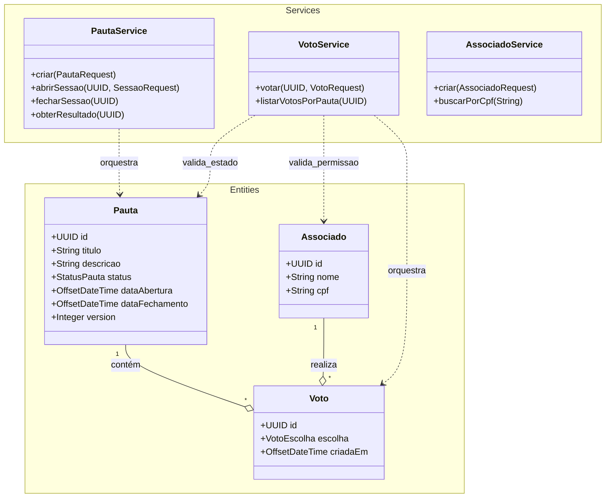

# Arquitetura do Sistema - Desafio Votação

Este documento detalha a estrutura de classes e as interações entre os componentes do sistema.

## Diagrama de Classes (Detallhado)

Abaixo, o diagrama completo das entidades e serviços:

## Fluxo de Votação
1. O **Associado** envia um `VotoRequest` para o `PautaController`.
2. O `VotoService` valida se a **Pauta** está aberta e se o **Associado** já votou.
3. Se permitido, o **Voto** é persistido no banco de dados.
4. O campo `@Version` na **Pauta** garante que atualizações concorrentes não corrompam o estado da sessão.

## Considerações de Design
- **Optimistic Locking**: Implementado via JPA `@Version` na `Pauta` para evitar conflitos em sessões de alta volumetria.
- **DTOs**: Separação clara entre as entidades de banco e os contratos de entrada/saída (Request/Response).
